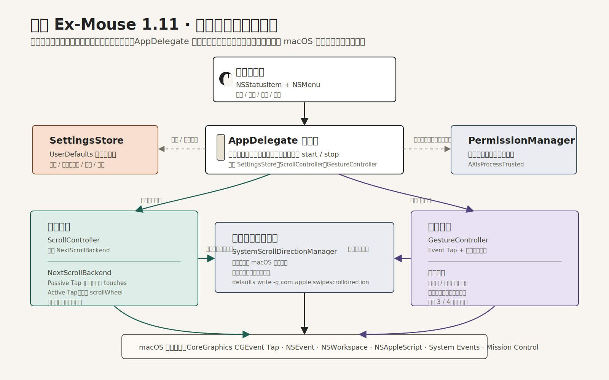

# 顺鼠 Ex-Mouse

<p align="center">
  
</p>

<p align="center">
  一个轻量的 macOS 菜单栏鼠标增强工具，让鼠标和触控板各自保持顺手的操作方式。
</p>

<p align="center">
  
  
  <a href="LICENSE"></a>
</p>

## 作者的话

我不愿意使用太复杂的 Mac 鼠标设置软件，所以让 Codex 设计了这个小工具。

这是一个极其精简、无感的 Mac 鼠标设置工具，主要用于：

1. 让 Mac 触控板与鼠标滚轮各自保持顺手的滚动方向。
2. 利用鼠标侧键切换不同桌面。
3. 利用鼠标手势切换不同桌面（按住中键滑动）。

这个项目从前到后都是 Codex 帮我完成的。我自己用着挺好，估计也有和我一样的朋友需要，
所以把它分享出来。

如果使用过程中有任何不合适的地方，请提醒我。谢谢！

## 它能做什么

| 功能 | 操作 |
| --- | --- |
| 独立滚动方向 | 保持触控板自然滚动，只反转鼠标滚轮 |
| 切换桌面 | 按住鼠标中键向左或向右滑动 |
| 打开调度中心 | 按住鼠标中键纵向滑动 |
| 快速切换桌面 | 使用鼠标侧键前进或后退 |

所有功能都可以在菜单栏的顺鼠图标中单独开启或关闭。

> 当前版本：`1.11`。项目仍处于早期阶段，不同品牌鼠标、驱动和 macOS
> 版本可能存在兼容性差异。

## 系统要求

- macOS 13 Ventura 或更高版本
- Apple Silicon 或 Intel Mac
- 从源码构建时需要 Swift 6.3/Xcode Command Line Tools
- 带中键或侧键的鼠标，具体按键编号取决于设备和驱动

## 安装

目前尚未提供经过 Apple Developer ID 签名和公证的安装包，需要从源码构建。

```bash
git clone https://github.com/LUANZHENZHANG/macmouseplus.git
cd macmouseplus
./scripts/build_app.sh
./scripts/install_app.sh
open /Applications/顺鼠.app || open ~/Applications/顺鼠.app
```

构建产物位于 `dist/顺鼠.app`。安装脚本优先安装到
`/Applications/顺鼠.app`；没有写入权限时，会安装到
`~/Applications/顺鼠.app`。

### 更新

```bash
git pull
./scripts/build_app.sh
./scripts/install_app.sh
```

更新后请完全退出顺鼠并重新打开。macOS 有时会要求重新确认相关权限。

## 首次授权

顺鼠需要以下 macOS 权限才能监听鼠标事件并触发系统操作：

| 权限 | 用途 |
| --- | --- |
| 辅助功能 | 监听和修改滚轮、鼠标中键及侧键事件 |
| 输入监控 | 在其他应用运行时接收全局鼠标事件 |
| 自动化 | 通过 System Events 发送切换桌面的系统快捷键 |

首次启动后，打开：

`系统设置 → 隐私与安全性`

在“辅助功能”“输入监控”和“自动化”中允许 `顺鼠.app`。授权后完全退出并重新启动应用。

顺鼠不连接网络，不包含遥测，不上传鼠标事件，也不记录键盘输入。设置仅保存在本机的
`UserDefaults` 中。源代码中的事件监听实现可以在
[`Sources/MacMousePlus`](Sources/MacMousePlus) 中审查。

## 使用

启动后，顺鼠只显示在 macOS 菜单栏，不会出现在 Dock 中。

菜单中包含：

- **状态**：检查权限、滚动监听和手势监听是否正常。
- **设置**：分别开关独立滚动、中键手势和侧键功能。
- **调试**：显示最近一次事件处理结果，并提供系统权限设置入口。
- **退出**：停止所有监听，并恢复启动前的系统滚动方向设置。

如果菜单显示“监听创建失败”，通常是权限尚未生效。请检查系统设置，完全退出应用后再启动。

## 开机启动

```bash
./scripts/install_launchagent.sh
```

关闭开机启动：

```bash
./scripts/uninstall_launchagent.sh
```

该脚本会在 `~/Library/LaunchAgents` 中安装当前用户的 LaunchAgent。

## 卸载

```bash
./scripts/uninstall_launchagent.sh
./scripts/uninstall_app.sh
```

如需清除系统授权记录，可在“系统设置 → 隐私与安全性”中移除顺鼠。

## 已知限制

- 滚轮来源通过事件特征判断，少数高分辨率鼠标可能被误判为触控板。
- 侧键编号由鼠标和驱动决定，部分设备的前进/后退方向可能相反或无法识别。
- 桌面切换依赖 macOS 的 `Control + ←/→` 系统快捷键。
- 当前构建使用临时签名，没有 Apple 公证；它适合自行构建和测试，不等同于正式发行包。
- 项目目前没有自动化测试套件，提交前至少应执行 `swift build` 和应用打包验证。

遇到问题时，请先查看菜单中的“状态”和“调试”，再按
[Bug 报告模板](https://github.com/LUANZHENZHANG/macmouseplus/issues/new?template=bug_report.yml)
提交系统版本、鼠标型号和复现步骤。

## 项目结构

```text
Sources/MacMousePlus/   应用源码
scripts/                构建、安装和卸载脚本
assets/                 应用图标
launchd/                LaunchAgent 示例
docs/                   实现说明和历史方案
```



## 参与贡献

欢迎提交问题、兼容性反馈和 Pull Request。开始修改前请阅读
[CONTRIBUTING.md](CONTRIBUTING.md)，安全问题请按照
[SECURITY.md](SECURITY.md) 私下报告。

## 许可证

顺鼠使用 [MIT License](LICENSE) 开源。你可以使用、复制、修改和分发代码，
但需要保留原始版权和许可声明。软件按现状提供，不附带任何担保。
