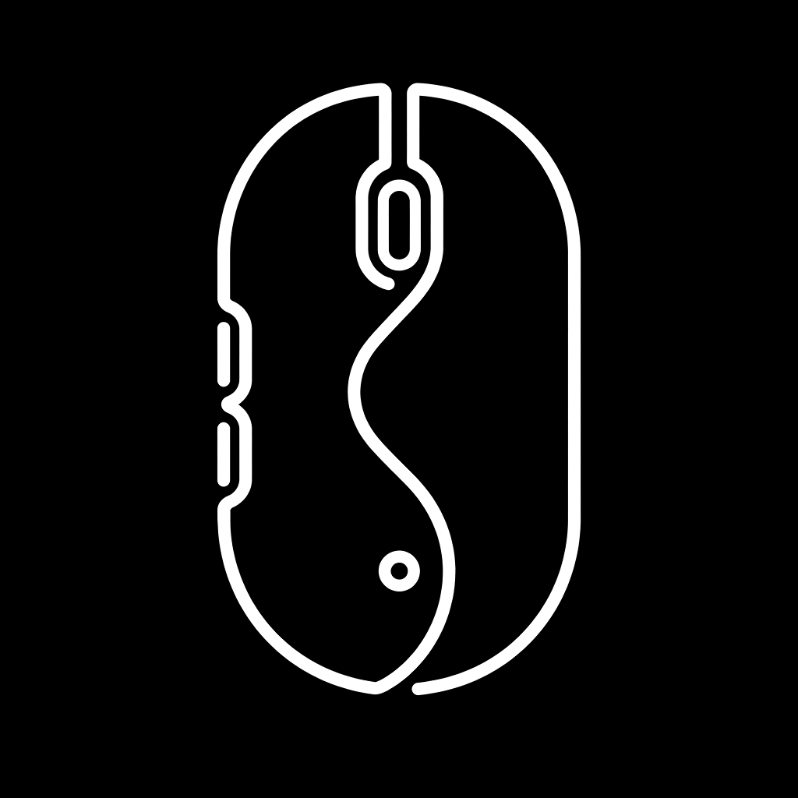

# 顺鼠 Ex-Mouse

  

  极简、无感、单机、不联网的 macOS 鼠标增强工具。

  
  
  

我在 Mac 使用中发现一些小问题：Magic Mouse 不好用、普通鼠标在 Mac 上无法使用手势，
滚轮方向也和触控板相反。我不愿意使用太复杂的 Mac 鼠标设置软件，所以让 Codex 设计了这个小工具。

顺鼠 Ex-Mouse 重点是不占资源、省空间、单机、不联网，主要用于：

- 让 Mac 触控板与鼠标滚轮各自保持顺手的滚动方向。
- 利用鼠标侧键切换不同桌面。
- 利用鼠标手势切换不同桌面（按住中键滑动）。

这个项目从前到后都是 Codex 帮我完成的。我自己用着挺好，估计也有和我一样的朋友需要，
所以把它分享出来。如果使用过程中有任何不合适的地方，请提醒我。谢谢！

## 目录

- [下载](#下载)
- [首次安装与授权](#首次安装与授权)
- [更新安装与授权](#更新安装与授权)
- [界面介绍与使用](#界面介绍与使用)
- [卸载](#卸载)
- [其他](#其他)

## 下载

**[下载顺鼠 Ex-Mouse 1.15 DMG 安装包](https://github.com/LUANZHENZHANG/Ex-Mouse/releases/download/v1.15/Ex-Mouse-1.15-macOS-arm64.dmg)**

- 文件名：`Ex-Mouse-1.15-macOS-arm64.dmg`
- 大小：约 2 MB
- 系统：macOS 13 Ventura 或更高版本
- 设备：Apple Silicon（M 系列）Mac

也可以前往 [Releases 页面](https://github.com/LUANZHENZHANG/Ex-Mouse/releases/latest)
查看最新版和更新说明。

## 首次安装与授权

### 1. 安装应用

1. 双击下载的 `.dmg` 文件。
2. 将“顺鼠.app”拖入窗口中的“Applications”文件夹。
3. 打开 Finder，在“应用程序”中找到“顺鼠”。
4. 第一次启动时，右键点击“顺鼠”，选择“打开”，然后再次确认“打开”。

当前安装包使用临时代码签名，尚未经过 Apple Developer ID 签名和公证，因此第一次启动时
不能直接双击打开。请只从本项目 GitHub Releases 下载。

### 2. 授予系统权限

授权是顺鼠正常工作的关键。顺鼠只需要一项 macOS 权限：

| 权限 | 用途 | 未授权时的表现 |
| --- | --- | --- |
| 辅助功能 | 处理滚轮、中键及侧键事件，并发送桌面切换快捷键 | 滚动和鼠标手势无效 |

首次启动顺鼠后：

1. 点击 macOS 菜单栏中的鼠标图标。
2. 点击菜单中的 **开启辅助功能权限…**。
3. 在打开的系统设置中允许“顺鼠”。
4. 如果列表中没有“顺鼠”，点击 `+`，从“应用程序”中手动添加“顺鼠.app”。
5. 顺鼠会自动检测授权并启动功能，不需要退出重开。

也可以手动进入：

`系统设置 → 隐私与安全性 → 辅助功能`

### 3. 检查授权是否生效

点击菜单栏中的顺鼠图标，打开 **状态**：

- `辅助功能权限：已开启`
- `滚动监听：已就绪`
- `手势监听：已就绪`

如果仍显示“未开启”或“创建失败”：

1. 回到 **调试** 子菜单，重新打开对应权限设置。
2. 先关闭系统设置中的顺鼠开关，再重新打开。
3. 如果仍无效，删除权限列表中的顺鼠，再通过 `+` 重新添加。
4. 等待一两秒，顺鼠会自动检测新权限；如果仍未就绪，再退出并重新启动。

## 更新安装与授权

1. 下载最新版 DMG。
2. 从菜单栏选择 **退出**，确保旧版顺鼠已经停止运行。
3. 打开新 DMG，将“顺鼠.app”拖入 Applications。
4. macOS 询问时选择 **替换**。
5. 在“应用程序”中右键点击新版顺鼠，选择 **打开**。

更新应用后，macOS 可能继续保留原授权，也可能因为应用内容发生变化而要求重新授权。
如果滚动或手势突然失效：

1. 打开顺鼠菜单的 **状态**，确认哪一项没有就绪。
2. 从 **调试** 子菜单进入辅助功能设置。
3. 关闭再打开该权限；无效时删除旧的顺鼠记录，再通过 `+` 添加新版。
4. 完全退出并重新启动顺鼠。

更新后不需要清除个人设置，原来的功能开关通常会继续保留。

## 界面介绍与使用

顺鼠启动后只显示在 macOS 菜单栏，不会出现在 Dock 中。点击菜单栏中的鼠标图标即可操作。

### 状态

用于检查辅助功能权限、滚动监听和手势监听是否正常。遇到功能失效时先查看这里。

### 设置

- **启用独立滚动方向**：保持触控板自然滚动，只反转鼠标滚轮。
- **启用手势功能**：总开关，关闭后不监听中键和侧键手势。
- **启用中键滑动手势**：按住中键左右滑动切换桌面，纵向滑动或双击中键打开调度中心。
- **启用侧键切换桌面**：使用鼠标侧键切换上一个或下一个桌面。

### 调试

显示最近一次滚动和手势处理结果，并提供以下授权入口：

- 申请并检查辅助功能权限
- 打开辅助功能设置

### 退出

停止所有监听并退出顺鼠。需要更新、卸载或重新授权时，应先从这里退出。

## 卸载

1. 点击菜单栏中的顺鼠图标，选择 **退出**。
2. 打开 Finder 的“应用程序”目录。
3. 将“顺鼠.app”移到废纸篓。
4. 打开 `系统设置 → 隐私与安全性`。
5. 如需彻底清理，在“辅助功能”中删除顺鼠记录。

## 其他

### 隐私

顺鼠不连接网络，不包含遥测，不上传鼠标事件，也不记录键盘输入。所有设置仅保存在本机。

### 已知限制

- 当前安装包仅支持 Apple Silicon（M 系列）Mac。
- 安装包使用临时代码签名，没有 Apple 公证。
- 滚轮来源通过事件特征判断，少数高分辨率鼠标可能被误判为触控板。
- 侧键编号由鼠标和驱动决定，部分设备的前进/后退方向可能相反或无法识别。
- 桌面切换依赖 macOS 的 `Control + ←/→` 系统快捷键。

### 反馈与开源

遇到问题时，请先查看菜单中的“状态”和“调试”，再通过
[Bug 报告模板](https://github.com/LUANZHENZHANG/Ex-Mouse/issues/new?template=bug_report.yml)
提交系统版本、鼠标型号、权限状态和复现步骤。

项目使用 [MIT License](LICENSE) 开源。参与贡献请阅读
[CONTRIBUTING.md](CONTRIBUTING.md)，安全问题请按照
[SECURITY.md](SECURITY.md) 私下报告。
