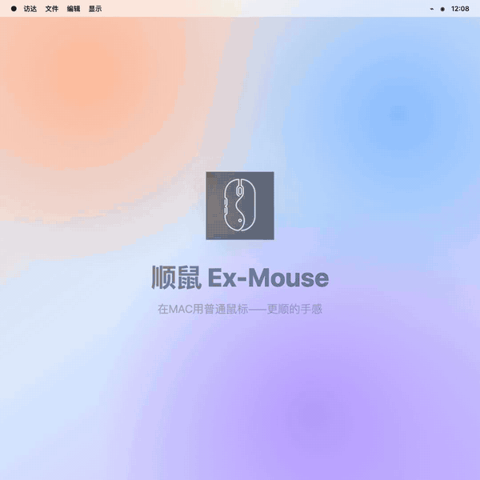

# 顺鼠 Ex-Mouse

  

我在 Mac 使用中发现一些小问题：Magic Mouse 不好用、普通鼠标在 Mac 上无法使用手势、滚轮方向也和触控板相反。

我不愿意使用太复杂的 Mac 鼠标设置软件，所以让 Codex 设计了这个小工具。

顺鼠 / Ex-Mouse 轻量、单机、不联网，主要功能：

- 让 Mac 触控板与鼠标滚轮各自保持顺手的滚动方向。
- 使用鼠标侧键或按住中键左右滑动切换桌面。
- 按住中键纵向滑动或双击中键打开调度中心。

这个项目从前到后都是 Codex 帮我完成的。我自己用着挺好，所以分享给有同样需要的朋友；如果使用中有任何问题，请提醒我。谢谢！

## 功能演示

  

## 目录

- [下载](#下载)
- [首次安装与授权](#首次安装与授权)
- [更新安装与授权](#更新安装与授权)
- [界面介绍与使用](#界面介绍与使用)
- [卸载](#卸载)
- [其他](#其他)

## 下载

**[下载顺鼠 Ex-Mouse 1.17 DMG 安装包](https://github.com/LUANZHENZHANG/Ex-Mouse/releases/download/v1.17/Ex-Mouse-1.17-macOS-arm64.dmg)**

适用于 macOS 13 或更高版本的 Apple Silicon（M 系列）Mac。

## 首次安装与授权

1. 打开下载的 DMG，将“顺鼠.app”拖入“Applications”文件夹。
2. 在“应用程序”中找到顺鼠，右键选择 **打开**，再确认打开。
3. 点击菜单栏中的鼠标图标，选择 **开启辅助功能权限…**。
4. 在 `系统设置 → 隐私与安全性 → 辅助功能` 中允许“顺鼠”。
5. 返回顺鼠菜单，确认直接显示：
   - `辅助功能权限：已开启`
   - `滚动监听：已就绪`
   - `鼠标监听：已就绪`

如果系统列表中没有顺鼠，点击 `+`，从“应用程序”中添加“顺鼠.app”。

## 更新安装与授权

1. 从顺鼠菜单中选择 **退出**。
2. 打开新版 DMG，将“顺鼠.app”拖入“Applications”，选择 **替换**。
3. 右键打开新版顺鼠。
4. 检查顺鼠菜单中的“状态”。如果功能未就绪，请在辅助功能设置中关闭再重新允许顺鼠。

## 界面介绍与使用

顺鼠只显示在菜单栏中，不会出现在 Dock 中。点击菜单栏中的鼠标图标即可操作。

- 点击菜单栏图标后会直接显示授权、滚动和鼠标监听状态。
- **启用滚轮独立滚动方向**：让鼠标滚轮与触控板各自保持顺手的方向。
- **启用中键+手势功能**：按住中键左右滑动切换桌面，上下滑动打开或关闭调度中心。
- **启用中键侧键快捷键**：使用侧键切换桌面，双击中键打开或关闭调度中心。
- **详情**：查看作者、版本、联系方式、项目简介和使用演示。
- **调试**：查看最近一次处理结果，并可重新打开授权设置。
- **退出**：停止顺鼠。

## 卸载

1. 从顺鼠菜单中选择 **退出**。
2. 将“应用程序”中的“顺鼠.app”移到废纸篓。
3. 如需彻底清理，可在辅助功能设置中删除顺鼠。

## 其他

- 顺鼠不联网、不包含遥测，也不上传鼠标事件或记录键盘输入。
- 当前版本仅支持 Apple Silicon（M 系列）Mac。
- 安装包尚未经过 Apple 公证，因此首次启动需要右键选择“打开”。
- 更新后如果授权失效，请在辅助功能设置中删除原有顺鼠，再重新添加新版。
- 少数鼠标的侧键编号或滚轮事件不同，可能出现方向相反、无法识别等兼容性问题。
- 项目使用 [MIT License](LICENSE) 开源。问题反馈请前往 [GitHub Issues](https://github.com/LUANZHENZHANG/Ex-Mouse/issues)。
